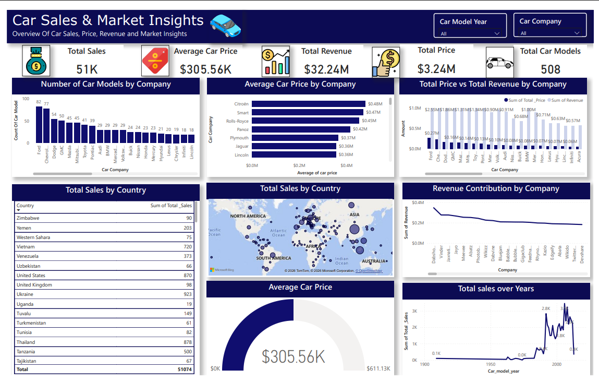

# Car Sales & Market Insights

## 📊 Project Overview

**Car Sales & Market Insights** is an interactive Power BI dashboard designed to analyse car sales, pricing, revenue, company performance, geographic sales distribution, and market trends.

The dashboard transforms raw car, product, and country-level datasets into an interactive business intelligence report that provides a clear overview of key sales and market performance indicators.

---

## 📸 Dashboard Preview



---

## 🎯 Project Objectives

The dashboard was developed to answer the following business questions:

1. What is the total sales generated?
2. What is the average price of cars?
3. How many car models does each company have?
4. What is the average car price for each company?
5. What is the maximum car price for each company?
6. What are the total price and total revenue generated by each company?
7. How are total sales distributed across different countries?
8. How does total sales vary across car model years?
9. Which companies contribute the most to overall revenue?
10. What are the key patterns and trends in car pricing and sales?

---

## 📌 Dashboard Highlights

### KPI Metrics

The dashboard provides a high-level summary of:

- **Total Sales**
- **Average Car Price**
- **Total Revenue**
- **Total Price**
- **Total Car Models**

### Company Analysis

The dashboard analyses car companies through:

- Number of car models by company
- Average car price by company
- Total price vs total revenue by company
- Revenue contribution by company

### Geographic Analysis

The dashboard provides country-level sales analysis through:

- Total sales by country table
- Total sales by country map

### Pricing Analysis

The dashboard includes:

- Average car price
- Average car price by company
- Comparison of car prices across companies

### Time-Based Analysis

The dashboard includes a sales trend showing:

- Total sales across car model years
- Changes in sales volume over time

---

## 📊 Dashboard Visualisations

| Visualisation | Purpose |
|---|---|
| Total Sales | Shows overall sales volume |
| Average Car Price | Displays the average car price |
| Total Revenue | Shows overall revenue |
| Total Price | Displays total product price |
| Total Car Models | Shows the number of car models |
| Number of Car Models by Company | Compares the number of models across companies |
| Average Car Price by Company | Compares average pricing between companies |
| Total Price vs Total Revenue by Company | Compares financial performance by company |
| Total Sales by Country | Provides country-level sales figures |
| Total Sales by Country Map | Shows geographic sales distribution |
| Revenue Contribution by Company | Shows revenue contribution across companies |
| Average Car Price Gauge | Highlights the overall average car price |
| Total Sales over Years | Shows sales trends across car model years |

---

## 🛠️ Tools & Technologies

- **Microsoft Power BI**
- **Power Query**
- **DAX**
- **Data Cleaning & Transformation**
- **Data Modelling**
- **Data Visualisation**
- **Data Analysis**

---

## 🗂️ Dataset

The project uses three datasets:

### 1. Company Dataset

**File:** `Company.csv`

Contains car company and car model information used for company-level analysis.

### 2. Country Dataset

**File:** `Country.csv`

Contains country-level information used for geographic and country sales analysis.

### 3. Products Dataset

**File:** `Products.csv`

Contains product-level information including sales, prices, revenue, and company-related data.

---

## 🔄 Data Preparation

The data preparation process included:

1. Importing the CSV datasets into Power BI.
2. Reviewing and validating column data types.
3. Cleaning and preparing fields for analysis.
4. Checking numerical fields such as sales, price, and revenue.
5. Applying appropriate aggregations.
6. Building interactive visualisations.
7. Adding slicers for dynamic analysis.
8. Designing a single-page executive dashboard.

---

## 🎛️ Interactive Features

The dashboard includes interactive filters for:

- **Car Model Year**
- **Car Company**

These slicers allow users to dynamically explore the dashboard and analyse specific segments of the car market.

---

## 💡 Key Insights

The dashboard allows users to identify:

- Companies with the largest number of car models.
- Companies with higher average car prices.
- Companies contributing more to overall revenue.
- Countries with higher sales volumes.
- Changes in sales across different car model years.
- Differences between total product price and revenue.
- Overall pricing patterns within the car market.

---

## 🚀 Project Outcome

This project demonstrates practical skills in:

- Data cleaning and transformation
- Data analysis using Power BI
- Data visualisation
- KPI development
- Business intelligence reporting
- Interactive dashboard design
- Geographic data analysis
- Sales and revenue analysis
- Data storytelling

The final dashboard provides a **single-page executive overview** of car sales, pricing, revenue, company performance, and geographic distribution.

---

## 📁 Repository Files

```text
Car-Sales-Market-Insights/
│
├── CAR SALES & MARKET INSIGHTS.pbix
├── Company.csv
├── Country.csv
├── Products.csv
├── car-sales-and-market-insights.png
└── README.md
